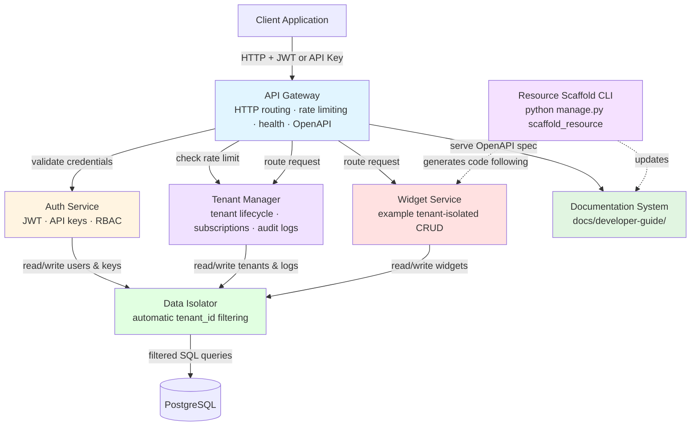
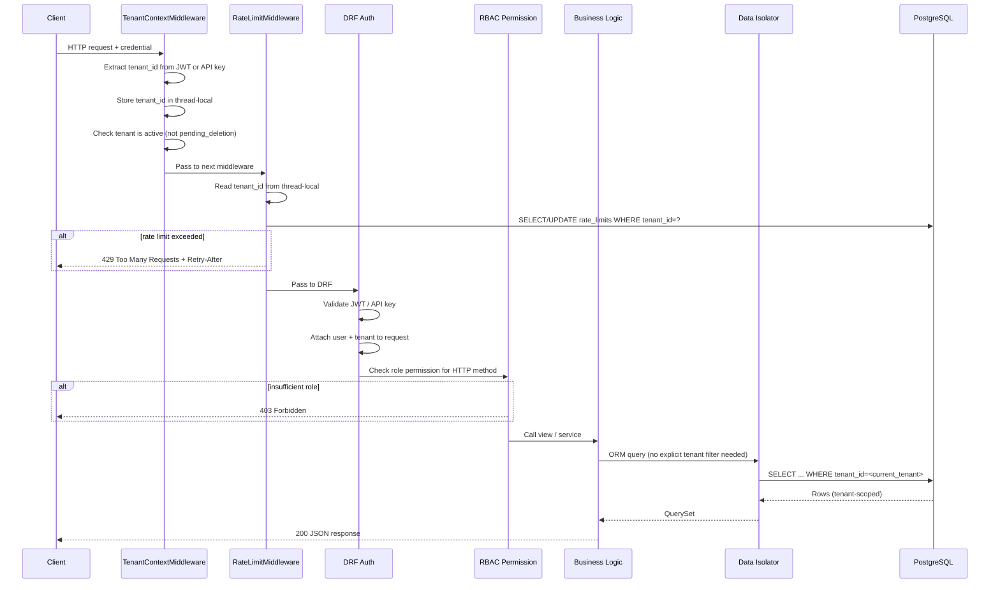
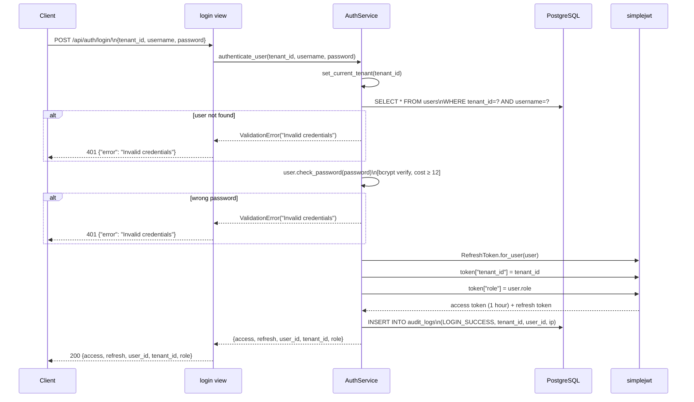

# Architecture

This document describes the system architecture of the multi-tenant SaaS backend — how the components fit together, how requests flow through the system, and how tenant isolation is enforced at every layer.

---

## System Overview

The backend is a Django 5.x + Django REST Framework application backed by a single PostgreSQL database. It uses a **shared-database, shared-schema** multi-tenancy model: all tenants live in the same database and the same tables, with a `tenant_id` column on every table enforcing isolation.

Key technology choices:

| Component              | Technology                                                  |
| ---------------------- | ----------------------------------------------------------- |
| Web framework          | Django 5.x + Django REST Framework                          |
| Database               | PostgreSQL (single database, shared schema)                 |
| Authentication         | `djangorestframework-simplejwt` (JWT) + custom API key auth |
| API documentation      | `drf-spectacular` (OpenAPI 3.0 + Swagger UI)                |
| Property-based testing | `hypothesis`                                                |

---

## Component Diagram



### Component Responsibilities

**API Gateway** (`api/`, `core/middleware.py`)

- Entry point for all HTTP requests
- `TenantContextMiddleware` extracts tenant ID from credentials and stores it in thread-local storage
- `RateLimitMiddleware` enforces per-tenant hourly request quotas
- Health check endpoint at `/health`
- OpenAPI spec + Swagger UI at `/api/docs/`

**Auth Service** (`authentication/`)

- Password-based login → JWT access + refresh tokens
- API key generation (SHA-256 hashed, stored only as hash)
- API key authentication via `Authorization: ApiKey <key>` or `X-API-Key` header
- Role-based access control (RBAC) with three roles: `admin`, `user`, `read_only`
- Audit logging for all authentication events

**Tenant Manager** (`tenants/`)

- Tenant registration (creates tenant + initial admin user)
- Subscription tier management (`free` / `professional` / `enterprise`)
- Tenant deletion with soft-delete and cascade cleanup
- Audit log retrieval (tenant-scoped)

**Data Isolator** (`core/data_isolator.py`)

- `TenantIsolatedModel` — abstract Django model base class; overrides `save()` and `delete()` to validate tenant context
- `TenantManager` — custom Django model manager; overrides `get_queryset()` to automatically append `WHERE tenant_id = <current_tenant>` to every query
- Reads current tenant from thread-local storage set by `TenantContextMiddleware`

**Widget Service** (`widgets/`)

- Reference implementation of a tenant-isolated CRUD resource
- Demonstrates the patterns to follow when building your own resources
- Full create / list / retrieve / update / delete with RBAC enforcement

**Resource Scaffold CLI** (`core/management/commands/scaffold_resource.py`)

- `python manage.py scaffold_resource <ResourceName>`
- Generates model, serializer, service, views, URLs, and test files following the Widget pattern

---

## Multi-Tenant Architecture

### Isolation Strategy

This system uses **single-database multi-tenancy with a `tenant_id` discriminator column**. Every table that holds tenant data has a `tenant_id` foreign key referencing the `tenants` table with `ON DELETE CASCADE`.

Isolation is enforced at three levels:

1. **Middleware layer** — `TenantContextMiddleware` extracts the tenant from the incoming credential and stores it in thread-local storage before any business logic runs.
2. **ORM layer** — `TenantManager.get_queryset()` automatically filters every Django queryset by the current tenant. No view or service needs to add `.filter(tenant_id=...)` manually.
3. **Model layer** — `TenantIsolatedModel.save()` and `.delete()` validate that the object's `tenant_id` matches the current thread-local tenant, preventing cross-tenant writes even if the ORM filter is bypassed.

### Why Single-Database?

See [ADR 002 — Tenant Isolation Strategy](../adr/002-tenant-isolation-strategy.md) for the full rationale. The short version: a single database is simpler to operate, migrate, and back up at the cost of requiring disciplined query filtering — which the Data Isolator handles automatically.

### Tenant Lifecycle

```
register → active → pending_deletion → (cascade delete) → removed
```

- `active` — normal operation
- `pending_deletion` — `TenantContextMiddleware` returns `403` for all requests; a management command (`cleanup_deleted_tenants`) removes the data
- `deleted` — tenant record and all related data removed via FK cascade

---

## Request Flow

### Standard API Request



### Authentication Flow (JWT Login)



The JWT access token payload contains:

```json
{
  "user_id": "<uuid>",
  "tenant_id": "<tenant-slug>",
  "role": "admin | user | read_only",
  "exp": <unix-timestamp>,
  "iat": <unix-timestamp>
}
```

`TenantContextMiddleware` reads `tenant_id` directly from the validated token on every subsequent request — no database lookup required for tenant resolution.

---

## Authentication and Authorization

### Authentication Methods

| Method                  | Header                          | How it works                                                                                |
| ----------------------- | ------------------------------- | ------------------------------------------------------------------------------------------- |
| JWT Bearer              | `Authorization: Bearer <token>` | `simplejwt` validates signature + expiry; `TenantContextMiddleware` reads `tenant_id` claim |
| API Key (header)        | `Authorization: ApiKey <key>`   | SHA-256 hash of key looked up in `api_keys` table                                           |
| API Key (custom header) | `X-API-Key: <key>`              | Same as above                                                                               |

API keys are never stored in plaintext. Only the SHA-256 hash is persisted. The plaintext key is returned once at creation time.

### Role-Based Access Control

Three roles are supported, with a strict permission hierarchy:

| Role        | read | write | delete | admin ops |
| ----------- | ---- | ----- | ------ | --------- |
| `admin`     | ✓    | ✓     | ✓      | ✓         |
| `user`      | ✓    | ✓     | ✓      | ✗         |
| `read_only` | ✓    | ✗     | ✗      | ✗         |

Roles are embedded in the JWT token and enforced by DRF permission classes:

- `RoleBasedPermission` — auto-detects required operation from HTTP method (GET→read, POST/PUT/PATCH→write, DELETE→delete)
- `IsAdmin` — requires `admin` role
- `IsAdminOrUser` — requires `admin` or `user` role

RBAC is always scoped within a tenant — an admin in tenant A has no privileges in tenant B.

---

## Database Schema

### Entity-Relationship Diagram

```mermaid
erDiagram
    TENANTS ||--o{ USERS : "contains"
    TENANTS ||--o{ API_KEYS : "owns"
    TENANTS ||--o{ AUDIT_LOGS : "generates"
    TENANTS ||--o| RATE_LIMITS : "has"
    TENANTS ||--o{ WIDGETS : "owns"
    USERS ||--o{ API_KEYS : "creates"
    USERS ||--o{ WIDGETS : "creates"

    TENANTS {
        varchar id PK "slug, e.g. acme-corp"
        varchar subscription_tier "free | professional | enterprise"
        timestamp subscription_expiration
        varchar status "active | pending_deletion | deleted"
        timestamp created_at
        timestamp deleted_at "nullable"
    }

    USERS {
        uuid id PK
        varchar tenant_id FK
        varchar username
        varchar email
        varchar password "bcrypt hash"
        varchar role "admin | user | read_only"
        timestamp created_at
        boolean is_active
    }

    API_KEYS {
        uuid id PK
        varchar tenant_id FK
        uuid user_id FK
        varchar key_hash "SHA-256 of plaintext key"
        boolean revoked
        timestamp created_at
        timestamp revoked_at "nullable"
    }

    AUDIT_LOGS {
        uuid id PK
        varchar tenant_id FK
        varchar event_type
        uuid user_id "nullable FK"
        timestamp timestamp
        jsonb details
        varchar ip_address "nullable"
    }

    RATE_LIMITS {
        varchar tenant_id PK_FK
        integer request_count
        timestamp window_start "start of current 1-hour window"
    }

    WIDGETS {
        uuid id PK
        varchar tenant_id FK
        varchar name
        text description "nullable"
        jsonb metadata
        uuid created_by FK "users.id"
        timestamp created_at
        timestamp updated_at
    }
```

### Tenant Isolation in the Schema

Every table except `tenants` itself has:

```sql
tenant_id VARCHAR(255) NOT NULL REFERENCES tenants(id) ON DELETE CASCADE
```

The `ON DELETE CASCADE` means deleting a tenant row automatically removes all users, API keys, audit logs, rate limits, and widgets for that tenant — no application-level cleanup loop needed.

### Key Indexes

Each tenant-scoped table has a `(tenant_id)` index to make the automatic `WHERE tenant_id = ?` filter fast. Composite indexes cover the most common query patterns:

| Table        | Index                              | Purpose                        |
| ------------ | ---------------------------------- | ------------------------------ |
| `users`      | `(tenant_id, email)`               | Login by email                 |
| `api_keys`   | `(key_hash) WHERE revoked = FALSE` | API key lookup                 |
| `audit_logs` | `(tenant_id, timestamp DESC)`      | Paginated audit log queries    |
| `widgets`    | `(tenant_id, name)`                | Uniqueness check + name search |
| `widgets`    | `(tenant_id, created_at DESC)`     | Default list ordering          |

---

## Rate Limiting

Rate limits are enforced per tenant per hour using a sliding-window counter stored in the `rate_limits` table.

| Subscription tier | Requests / hour |
| ----------------- | --------------- |
| `free`            | 100             |
| `professional`    | 1,000           |
| `enterprise`      | 10,000          |

When a subscription expires, the tenant is downgraded to `free` tier limits automatically.

`RateLimitMiddleware` uses `SELECT FOR UPDATE` inside a transaction to safely increment the counter under concurrent load. When the limit is exceeded, it returns:

```http
HTTP/1.1 429 Too Many Requests
Retry-After: <seconds until next hour window>

{"error": {"code": "RATE_LIMIT_EXCEEDED", "message": "..."}}
```

---

## Audit Logging

Security-relevant events are written to the `audit_logs` table by `core/audit_logger.py`. Events include:

- `LOGIN_SUCCESS` / `LOGIN_FAILURE`
- `API_KEY_CREATED` / `API_KEY_REVOKED`
- `ROLE_CHANGED`
- `SUBSCRIPTION_CHANGED`
- `TENANT_DELETED`

Audit logs are tenant-scoped — the `TenantManager` on `AuditLog` ensures tenants can only query their own logs. Logs are retained for a minimum of 90 days (enforced by the `cleanup_audit_logs` management command).

---

## Django App Structure

```
config/          # Django settings, WSGI/ASGI, root URL conf
api/             # API Gateway: URL routing, health check, exception handler
authentication/  # Auth Service: models, views, services, permissions
tenants/         # Tenant Manager: models, views, services
core/            # Data Isolator, middleware, audit logger, management commands
widgets/         # Widget Service: example tenant-isolated CRUD resource
docs/            # Developer documentation
```

Each Django app follows the same internal layout:

```
<app>/
  models.py       # Django ORM models (extend TenantIsolatedModel)
  serializers.py  # DRF serializers for request/response validation
  views.py        # DRF API views with @extend_schema decorators
  services.py     # Business logic (called by views)
  permissions.py  # DRF permission classes
  urls.py         # URL patterns for this app
  tests.py        # Unit + integration tests
```

---

## Further Reading

- [Quickstart Guide](quickstart.md) — get the system running locally
- `docs/adr/` — Architecture Decision Records explaining key design choices
- `docs/developer-guide/adding-resources.md` — step-by-step guide for adding new tenant-isolated resources
- `authentication/README.md` — authentication module deep-dive
- `core/README.md` — Data Isolator and middleware internals
